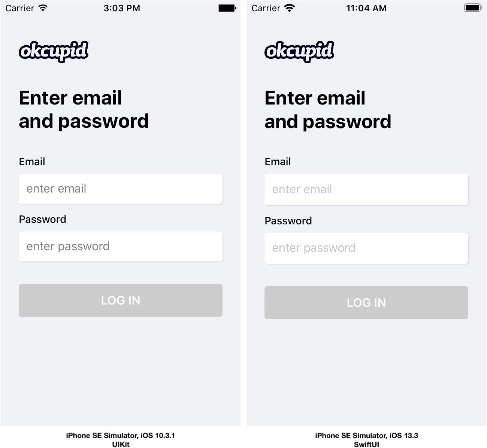

# Login Sample

Login Sample is a project exploring a gradual approach to integrating SwiftUI into an existing iOS application that supports multiple iOS versions. Login Sample illustrates a common user journey of logging into an application. To keep things simple, authentication with a server is replaced with local validation using regex. The application supports iOS versions 10 and up. Slowly integrating SwiftUI side by side with UIKit requires writing _some_ code twice. It's unavoidable. User interface construction, configuration, and state is implemented using its respective framework. However, the values used for configuration are shared. By sharing data from one source, specifically the `LoginViewModel`, updates only need to be made in one place which maximizes efficiency and minimizes the chance for discrepancy between the views. 

There are two main goals for this project:

1. Utilize shared abstractions and business logic when coding the user journey and building the user interface whether it's built using UIKit or SwiftUI. The main example of this is the `LoginViewModel` which provides most of the values and information needed to configure the login view.
2. When rendered on screen, the login view should look nearly identical regardless of the iOS version and framework used to construct the user interface.

